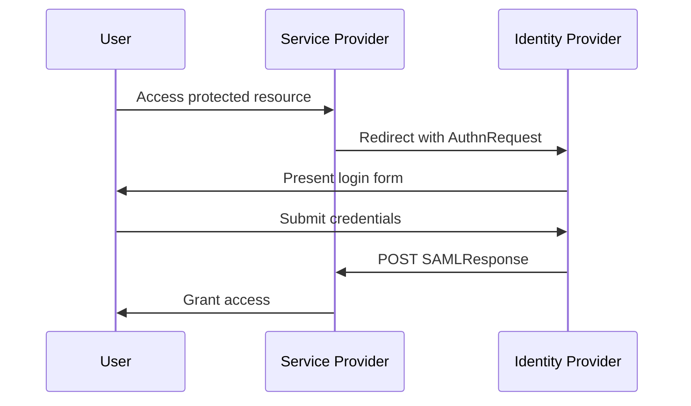

# Documentation Style Guide

**Version:** 1.0  
**Last Updated:** 2026-05-03  
**Maintained by:** Documentation Team  
**Toolchain:** MkDocs Material / Git / GitHub Actions

---

## Table of Contents

- [Documentation Style Guide](#documentation-style-guide)
  - [Table of Contents](#table-of-contents)
  - [Purpose and Scope](#purpose-and-scope)
  - [Docs-as-Code Principles](#docs-as-code-principles)
  - [File and Folder Conventions](#file-and-folder-conventions)
    - [Naming](#naming)
    - [Structure](#structure)
    - [Front Matter](#front-matter)
  - [Markdown Standards](#markdown-standards)
    - [General Rules](#general-rules)
  - [Voice and Tone](#voice-and-tone)
    - [Use Second Person](#use-second-person)
    - [Use Active Voice](#use-active-voice)
    - [Be Direct](#be-direct)
    - [Tone Spectrum](#tone-spectrum)
  - [Language and Grammar](#language-and-grammar)
    - [Tense](#tense)
    - [Sentence Length](#sentence-length)
    - [Punctuation](#punctuation)
    - [Capitalization](#capitalization)
    - [Numbers](#numbers)
  - [Headings and Structure](#headings-and-structure)
    - [Hierarchy](#hierarchy)
    - [Topic Types](#topic-types)
  - [Lists](#lists)
    - [Bulleted Lists](#bulleted-lists)
    - [Numbered Lists](#numbered-lists)
  - [Tables](#tables)
  - [Code and Technical Content](#code-and-technical-content)
    - [Inline Code](#inline-code)
    - [Code Blocks](#code-blocks)
    - [Placeholders](#placeholders)
  - [Callouts and Admonitions](#callouts-and-admonitions)
  - [Links and Cross-References](#links-and-cross-references)
    - [Internal Links](#internal-links)
    - [External Links](#external-links)
    - [Link Text](#link-text)
  - [Images and Diagrams](#images-and-diagrams)
    - [File Location](#file-location)
    - [Alt Text](#alt-text)
    - [Format Guidelines](#format-guidelines)
    - [Mermaid Diagrams](#mermaid-diagrams)
  - [Versioning and Changelogs](#versioning-and-changelogs)
    - [Release Notes Format](#release-notes-format)
  - [Contribution Workflow](#contribution-workflow)
    - [Branch Naming](#branch-naming)
    - [Commit Messages](#commit-messages)
    - [Pull Request Checklist](#pull-request-checklist)
  - [Linting and Automation](#linting-and-automation)
    - [Vale](#vale)
    - [markdownlint](#markdownlint)
    - [Link Checking](#link-checking)
    - [CI Pipeline](#ci-pipeline)

---

## Purpose and Scope

This style guide defines standards for all documentation authored and maintained in this repository. It applies to:

- Product documentation (user guides, administrator guides, release notes)
- API reference documentation
- README files and contributing guides
- Internal wikis and runbooks

This guide does **not** apply to code comments, commit messages, or pull request descriptions (see the [Contributing Guide](CONTRIBUTING.md) for those conventions).

---

## Docs-as-Code Principles

All documentation in this repository follows the **docs-as-code** methodology:

| Principle | Practice |
|-----------|----------|
| Source control | All docs are versioned in Git alongside code |
| Plain text | Content is authored in Markdown (`.md`) |
| Review workflow | Changes go through pull requests with peer review |
| Automation | Linting, link-checking, and publishing are automated via CI/CD |
| Single source of truth | No duplicate content; use includes or snippets for reuse |

> **Why docs-as-code?** It enables writers and engineers to collaborate in the same workflow, ensures documentation stays in sync with product changes, and makes review history traceable.

---

## File and Folder Conventions

### Naming

- Use **lowercase** and **hyphens** for all file and folder names.
- No spaces, underscores, or camelCase in filenames.

```
✅ user-authentication.md
✅ api-reference/
❌ User_Authentication.md
❌ apiReference/
```

### Structure

```
docs/
├── getting-started/
│   ├── index.md
│   ├── installation.md
│   └── quickstart.md
├── guides/
│   ├── sso-configuration.md
│   └── rbac-setup.md
├── api/
│   ├── index.md
│   └── endpoints.md
├── release-notes/
│   └── 2026.md
└── index.md
```

### Front Matter

Every Markdown file must include YAML front matter at the top:

```yaml
---
title: Configuring Single Sign-On
description: How to configure SAML-based SSO for enterprise identity providers.
tags:
  - sso
  - saml
  - authentication
last_updated: 2026-05-03
---
```

| Field | Required | Description |
|-------|----------|-------------|
| `title` | Yes | Page title (used in nav and `<title>` tag) |
| `description` | Yes | 1–2 sentence summary for SEO and search |
| `tags` | Recommended | Lowercase, hyphenated keywords |
| `last_updated` | Yes | ISO 8601 date (`YYYY-MM-DD`) |

---

## Markdown Standards

Follow [CommonMark](https://commonmark.org/) specification. Avoid HTML in Markdown files unless absolutely necessary.

### General Rules

- Use `##` for the first heading in the body (the `# H1` is set by the `title` front matter field).
- Leave one blank line before and after every heading, list, table, code block, and admonition.
- End files with a single newline character.
- Maximum line length: **100 characters** (enforced by linter).
- Use **ATX-style headings** (`##`), not Setext-style (`---` underline).

---

## Voice and Tone

### Use Second Person

Address the reader directly as "you." Avoid "the user," "the administrator," or "one."

```
✅ You can configure SSO from the Settings page.
❌ The administrator can configure SSO from the Settings page.
```

### Use Active Voice

Prefer active constructions. Use passive voice only when the actor is unknown or irrelevant.

```
✅ The system generates an access token.
❌ An access token is generated by the system.
```

### Be Direct

Omit filler phrases that delay the point.

```
✅ Select Save.
❌ You will want to go ahead and select the Save button.
```

### Tone Spectrum

| Context | Tone |
|---------|------|
| Conceptual topics | Informative, neutral |
| Procedures | Direct, action-oriented |
| Warnings and errors | Clear, non-alarmist |
| Release notes | Concise, factual |

---

## Language and Grammar

### Tense

Use **present tense** for procedures and descriptions.

```
✅ The dashboard displays active sessions.
❌ The dashboard will display active sessions.
```

### Sentence Length

Keep sentences under **25 words**. Break long sentences into two.

### Punctuation

- Use the **Oxford (serial) comma**: *roles, permissions, and policies*
- Do not use an ampersand (`&`) in running text; spell out "and."
- Em dash (—): use sparingly; no spaces around it.
- Avoid exclamation points in technical content.

### Capitalization

- **Sentence case** for headings: *Configuring role-based access control*
- **Title case** only for product names and proper nouns.
- **UI labels**: match exactly as shown in the interface (bold, no quotes): Press **Save**.
- **Acronyms**: spell out on first use, then use the acronym: *Single Sign-On (SSO)*

### Numbers

- Spell out zero through nine; use numerals for 10 and above.
- Exception: always use numerals with units: *3 GB*, *5 seconds*, *2 roles*.

---

## Headings and Structure

### Hierarchy

```markdown
## Section heading        ← H2: major topic area
### Subsection            ← H3: sub-topic
#### Task or component    ← H4: use sparingly
```

- Do not skip heading levels (e.g., do not jump from `##` to `####`).
- Do not use bold text as a substitute for a heading.
- Headings should be descriptive, not generic: use *Assigning roles to users*, not *Roles*.

### Topic Types

Structure pages by content type:

| Type | Purpose | Pattern |
|------|---------|---------|
| **Concept** | Explains what something is | Noun phrase heading + explanation + diagram |
| **Task** | Explains how to do something | Verb phrase heading + numbered steps |
| **Reference** | Lookup content (APIs, parameters) | Table or definition list |
| **Troubleshooting** | Resolves known issues | Symptom → Cause → Solution |

---

## Lists

### Bulleted Lists

Use for unordered items (no sequence required). Items should be parallel in structure.

```markdown
The SSO configuration requires:

- An identity provider (IdP) metadata URL
- A service provider (SP) entity ID
- A valid X.509 certificate
```

- Do not use a list for fewer than two items.
- End list items with a period only if they are complete sentences.
- Do not mix sentence fragments with complete sentences in the same list.

### Numbered Lists

Use for sequential steps (order matters).

```markdown
To enable SAML SSO:

1. Navigate to **Settings > Authentication**.
2. Select **Add Identity Provider**.
3. Enter the IdP metadata URL.
4. Select **Save**.
```

- Each step should contain one action.
- Do not embed lengthy explanations inside a step; follow the step with a note block if needed.

---

## Tables

Use tables for reference content with clear categories. Do not use tables for content that is better expressed as prose or a list.

```markdown
| Parameter     | Type    | Required | Description                        |
|---------------|---------|----------|------------------------------------|
| `client_id`   | string  | Yes      | OAuth 2.0 client identifier        |
| `redirect_uri`| string  | Yes      | Registered callback URL            |
| `scope`       | string  | No       | Space-separated permission scopes  |
```

- Include a header row.
- Align columns for readability in the source file.
- Keep cell content concise; link out for detail.

---

## Code and Technical Content

### Inline Code

Use backticks for:

- File names and paths: `config.yaml`, `/etc/nginx/nginx.conf`
- Command-line commands: `git commit`
- API endpoints: `/api/v1/users`
- Parameter and property names: `redirect_uri`
- Environment variables: `OAUTH_CLIENT_SECRET`
- Literal values: `true`, `null`

### Code Blocks

Always specify the language for syntax highlighting:

````markdown
```bash
curl -X POST https://api.example.com/auth/token \
  -H "Content-Type: application/json" \
  -d '{"client_id": "abc123", "grant_type": "client_credentials"}'
```
````

Supported language identifiers: `bash`, `yaml`, `json`, `python`, `javascript`, `xml`, `sql`, `http`, `markdown`, `text`

Use `text` when no syntax highlighting applies (e.g., log output, plain error messages).

### Placeholders

Use angle brackets for values the user must replace. Describe each placeholder below the block.

```bash
curl -X GET https://api.example.com/users/<USER_ID> \
  -H "Authorization: Bearer <ACCESS_TOKEN>"
```

Where:
- `<USER_ID>` — The unique identifier of the target user.
- `<ACCESS_TOKEN>` — A valid OAuth 2.0 bearer token.

---

## Callouts and Admonitions

Use MkDocs Material admonition syntax. Use sparingly—overuse dilutes impact.

```markdown
!!! note
    This setting applies only to SAML 2.0 configurations.

!!! warning
    Changing this value invalidates all active sessions.

!!! danger
    Do not expose `client_secret` values in client-side code.

!!! tip
    You can use wildcard patterns in redirect URIs for development environments.
```

| Type | Use for |
|------|---------|
| `note` | Helpful supplementary information |
| `tip` | Time-saving shortcuts or best practices |
| `warning` | Potential for misconfiguration or data loss |
| `danger` | Security risks or irreversible actions |

---

## Links and Cross-References

### Internal Links

Use relative paths from the current file.

```markdown
See [Role Assignment](../guides/rbac-setup.md) for details.
```

Do not link to `index.md` directly; link to the directory:

```
✅ [Getting Started](../getting-started/)
❌ [Getting Started](../getting-started/index.md)
```

### External Links

Use full HTTPS URLs. Do not use bare URLs in body text—always use descriptive link text.

```
✅ Refer to the [SAML 2.0 specification](https://docs.oasis-open.org/security/saml/v2.0/).
❌ See https://docs.oasis-open.org/security/saml/v2.0/.
```

### Link Text

Link text must describe the destination, not the action.

```
✅ See [Configuring RBAC](../guides/rbac-setup.md).
❌ Click [here](../guides/rbac-setup.md) to configure RBAC.
```

---

## Images and Diagrams

### File Location

Store all images in `docs/assets/images/`, organized by section:

```
docs/assets/images/
├── getting-started/
│   └── dashboard-overview.png
└── guides/
    └── sso-flow-diagram.png
```

### Alt Text

All images require descriptive alt text.

```markdown

```

### Format Guidelines

| Use | Format |
|-----|--------|
| Screenshots | `.png` |
| Diagrams | `.svg` (preferred) or `.png` |
| Animated demos | `.gif` (max 2 MB) |

- Maximum image width in content area: **900px**.
- Do not embed screenshots for every UI step; use them only when the interface is genuinely complex or non-obvious.
- Diagrams should be maintained as source (e.g., `.drawio`, `.mermaid`) in a `diagrams/` folder alongside the rendered output.

### Mermaid Diagrams

For flow diagrams and sequences, use embedded Mermaid blocks (supported by MkDocs Material):

````markdown

````

---

## Versioning and Changelogs

### Release Notes Format

File location: `docs/release-notes/<YEAR>.md`

```markdown
## Version 24.3 — March 2026

### New Features

**OAuth 2.0 Device Authorization Grant**  
Enables authentication on input-constrained devices (smart TVs, CLI tools) without a browser. See [Device Authorization](../guides/device-auth.md).

### Improvements

- Reduced token validation latency by 40% for high-concurrency deployments.
- Added pagination support to the `/api/v1/users` endpoint.

### Fixed Issues

| Issue ID | Description |
|----------|-------------|
| DOC-1842 | Incorrect parameter name in `/auth/token` example |
| SEC-209  | Session timeout now enforced on federated identity logout |

### Deprecations

> **`legacy_auth` parameter** — Deprecated in this release. Support ends in version 25.1.  
> Migrate to the `grant_type` parameter. See [Migration Guide](../guides/migration-24-25.md).
```

---

## Contribution Workflow

### Branch Naming

```
docs/<short-description>       # New content
fix/<issue-id>-short-desc      # Corrections
update/<component>-<version>   # Version-driven updates
```

### Commit Messages

Use imperative mood, present tense:

```
✅ Add SSO troubleshooting section
✅ Fix broken link in RBAC guide
❌ Added troubleshooting
❌ Fixed link
```

### Pull Request Checklist

Before opening a PR, confirm:

- [ ] Front matter is complete and accurate
- [ ] No broken internal links (`mkdocs serve` shows no warnings)
- [ ] Vale linter passes locally (`vale docs/`)
- [ ] New images have alt text and are stored in `docs/assets/images/`
- [ ] Release notes follow the standard format
- [ ] Related code PRs are linked in the description

---

## Linting and Automation

### Vale

This repo uses [Vale](https://vale.sh/) for style linting. Rules enforce:

- Microsoft Writing Style Guide conventions
- Custom rules: banned phrases, passive voice limits, Oxford comma
- Spelling exceptions defined in `vocab/accept.txt`

Run locally:

```bash
vale docs/
```

### markdownlint

Enforces Markdown formatting rules (line length, heading levels, list style).

```bash
markdownlint docs/
```

### Link Checking

Dead links are caught in CI via `lychee`:

```bash
lychee docs/**/*.md
```

### CI Pipeline

All checks run automatically on pull requests targeting `main`. A PR cannot be merged until all checks pass.

```yaml
# .github/workflows/docs-check.yml (excerpt)
jobs:
  lint:
    runs-on: ubuntu-latest
    steps:
      - uses: actions/checkout@v4
      - run: vale docs/
      - run: markdownlint docs/
      - run: lychee docs/**/*.md
```

---

